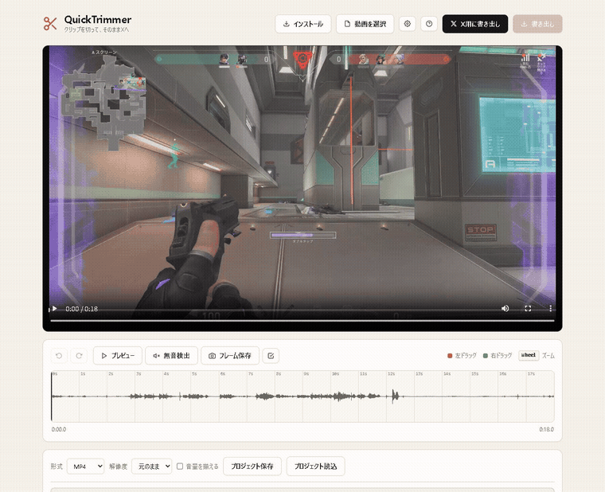

# QuickTrimmer

ゲームのクリップを、ドラッグで中間カットして、そのまま X へ。ブラウザだけで完結する動画トリミングツール。

[](#) [](#) [](#)



## なぜ作ったか

ゲームの神プレイをクリップに撮っても、X に上げる前に「前後の無駄を削る」のが地味に面倒です。既存ツールはほぼ「最初と最後をクロップ」しかできず、中間を消すには「分割 → 範囲を選んで削除」の3ステップ。しかも CapCut や Clipchamp は重い。

**QuickTrimmer は、タイムラインを左ドラッグするだけで中間カット**して、**そのまま X に上げられる MP4** で書き出せます。アップロード不要・ローカル処理・カットだけなら再エンコードなしの高速書き出し。

さらに、ゲームキャプチャ特有の「X に弾かれる」問題も自動で解決します。Steam の録画（HEVC）や PS5（WebM）のクリップは、拡張子が `.mp4` でも X に**無言で弾かれる**ことがあります。QuickTrimmer は中身のコーデックを見て、必要なときだけ自動で X 対応の H.264 MP4 に変換します（元から対応していれば無劣化のまま）。

## 主な機能

- 🐦 **X用に書き出し（ワンクリック）** — そのまま X に投稿できる MP4（H.264/AAC）で書き出し。元から対応なら無劣化のまま、必要なときだけ自動変換
- 🎮 **HEVC/VP9 を自動で X 対応に** — Steam(HEVC) や PS5(WebM/VP9) のクリップを、中身のコーデックを見て自動で H.264 MP4 に。4K は 1080p にクランプ
- 📐 **対 X 上限の表示** — 出力の長さ・推定サイズが X 無料枠の上限（2:20 / 512MB）内かをリアルタイム表示
- ✂ **ドラッグだけで中間カット** — 左ドラッグ＝削除範囲追加、右ドラッグ＝取り消し
- 🔇 **無音区間の自動検出** — しきい値・最小持続時間・パディングを調整可能
- ⚡ **倍速モード** — 完全削除する代わりに 2x / 4x / 8x で残せる
- 🚀 **再エンコードなし書き出し** — `-c copy` で高速＆画質ロスゼロ（カットだけの場合）
- 🎬 **ライブプレビュー** — ドラッグ中に動画フレームが追従、書き出し前の確認も可
- 📏 **波形＋目盛り表示** — タイムラインで音声の山と時刻を一目で確認
- 🔍 **ズーム** — マウスホイールで拡大、長尺動画でも細かい調整が可能
- 🗺 **動画ミニマップ** — プレイヤー上に削除/倍速範囲を常時表示
- ⌨ **キーボードショートカット** — Space, ←/→, I/O マーカー, Ctrl+Z, P, Delete
- ↶ **Undo / Redo** — 履歴 80件
- 💾 **プロジェクト保存** — localStorage で自動、JSON export/import 対応
- 🔊 **音量正規化** — `-af loudnorm` で出力音量を統一（EBU R128 -16 LUFS）
- 📸 **フレーム保存** — 任意の瞬間を PNG で書き出し
- 📤 **複数形式書き出し** — MP4 / WebM / GIF、解像度オプション
- 🛑 **書き出しキャンセル** — 重い処理を途中で止められる
- 📱 **PWA 対応** — オフラインでも動く、インストール可能

## 動かす

### ローカル開発

```bash
npm install
npm run dev
# → http://localhost:5173
```

dev サーバは COOP/COEP ヘッダ込みで動くので、`ffmpeg.wasm` の SharedArrayBuffer もそのまま動きます。

### プロダクションビルド

```bash
npm run build       # dist/ に出力
npm run preview     # ビルド済みファイルをローカルでプレビュー
```

### Vercel にデプロイ

```bash
npm i -g vercel
vercel              # 初回。プロジェクト紐付け
vercel --prod       # 本番デプロイ
```

`vercel.json` で COOP/COEP ヘッダが自動設定されるので、デプロイ後そのまま動きます。

## アーキテクチャ

100% クライアントサイド。動画データはサーバーに一切送られません。

```
┌─────────────────────────────────────────┐
│  Browser (Chrome / Edge / Safari)        │
│                                          │
│  ┌────────────┐  ┌────────────────────┐ │
│  │ Vite app   │  │ ffmpeg.wasm worker │ │
│  │ (~33 KB)   │←→│ (32 MB, cached)    │ │
│  └────────────┘  └────────────────────┘ │
│         ↓                ↓                │
│  ┌─────────────────────────────────────┐│
│  │ User's video file (in-memory only) ││
│  └─────────────────────────────────────┘│
└─────────────────────────────────────────┘
```

### スタック

- **Vite** (5.x) — 開発サーバとビルド
- **ffmpeg.wasm** (`@ffmpeg/ffmpeg` 0.12.x + `@ffmpeg/core` 0.12.x ESM) — 動画処理
- **Web Audio API** — 波形描画、無音検出
- **Canvas 2D** — 波形＋目盛り描画
- **vanilla JS** — フレームワークなし

### ディレクトリ構成

```
src/
├── main.js          # オーケストレーション・キーボード・UI イベント
├── timeline.js      # タイムライン描画、ドラッグ操作、ズーム、履歴
├── exporter.js      # ffmpeg.wasm 統合、ストリームコピー/再エンコード
├── silence.js       # 無音検出アルゴリズム
├── storage.js       # localStorage + JSON プロジェクト保存
├── settings.js      # ユーザー設定の永続化
├── thumbnails.js    # フレームサムネ生成（未統合）
└── style.css        # スタイル全部
public/
├── ffmpeg/          # ffmpeg-core.js + ffmpeg-core.wasm
├── icons/           # PWA アイコン
├── manifest.webmanifest
└── sw.js            # Service worker（オフラインキャッシュ）
```

## 動作要件

- **Chrome / Edge / Firefox** 最新版（Safari は AudioContext の挙動差で一部動作確認中）
- WebAssembly + SharedArrayBuffer 対応ブラウザ
- 4GB+ RAM 推奨（大きな動画を扱う場合）

## ライセンス

[GPL-3.0-or-later](LICENSE)。

QuickTrimmer は動画処理に **ffmpeg.wasm**（`@ffmpeg/core`）を同梱しており、この ffmpeg ビルドは `libx264` / `libx265` を含む **GPL** ビルドです。これがブラウザへ配布されるため、本プロジェクト全体も GPL-3.0 で配布します。ffmpeg のソースは [ffmpegwasm/ffmpeg.wasm](https://github.com/ffmpegwasm/ffmpeg.wasm) および [ffmpeg.org](https://ffmpeg.org/) から入手できます。

## ロードマップ

- [x] X用に書き出し（コーデック自動判定・1080p クランプ・対 X 上限表示）
- [ ] アスペクト比プリセット（1:1 / 9:16）— 縦・正方形で X フィードに最適化
- [ ] AI 字幕（Whisper.wasm）— ゲーム実況クリップに焼き込み字幕（X の無音自動再生対策）
- [ ] マルチクリップ対応（複数動画の結合トリミング）
- [ ] サムネイルストリップ表示
